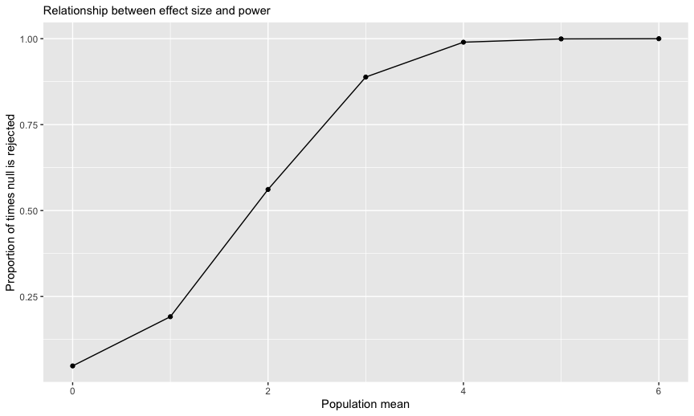

Homework 5
================

## Problem 1

We first read and save raw data in wide format (i.e. as `df`), with
associated file names and paths included.

``` r
df = tibble(files = list.files("data/prob_1/"),
            path = str_c("data/prob_1/", files)) %>% 
  mutate(data = map(path, read_csv)) %>% 
  unnest(cols = c(data))
```

We proceed to clean, tidy, and transpose the data into long format.

``` r
tidy = df %>% 
  mutate(files = str_replace(files, ".csv", ""),
         group = str_sub(files, 1, 3)) %>% 
  pivot_longer(week_1:week_8,
    names_to = "week",
    values_to = "outcome",
    names_prefix = "week_") %>% 
  mutate(week = as.numeric(week)) %>% 
  select(group, subj = files, week, outcome)
```

We then create a spaghetti plot to compare outcomes over time between
control- and experiment-group participants.

``` r
tidy %>% ggplot(aes(x = week, y = outcome, group = subj, color = group)) +
  geom_point() + 
  geom_path() + 
  facet_grid(~group)
```

<!-- -->

Outcomes appear to trend higher over time for participants in the
experimental group, relative to participants in the control group.

## Problem 2

We import `homicides` data from The Washington Post, consisting of
52,179 records on 12 variables, encompassing fields denoting the
identities (e.g. `victim_last`) and characteristics (e.g. `victim_age`)
of murder victims, as well as other homicide-related details
(e.g. `reported_date`) and case statuses (i.e. `disposition`).

We tidy `homicides` data by concatenating `city` and `state` into a
`city_state` field, recoding incorrectly recorded values where
applicable, creating a new `unsol_hm` field for unsolved homicides, and
then summarizing counts of total and unsolved homicides by city.

``` r
homicides = read_csv("data/homicide-data.csv") %>%
  mutate(city_state = str_c(city, ", ", state),
         city_state = recode(city_state, "Tulsa, AL" = "Tulsa, OK"), # apparent error in labeling of state
         unsol_hm = ifelse(disposition == "Closed without arrest" | disposition == "Open/No arrest", TRUE, FALSE)
         ) %>%
  relocate(city_state, .after = state) %>%
  group_by(city_state) %>%
  summarise(tot_hm = n_distinct(uid),
        tot_unsol_hm = n_distinct(uid[unsol_hm == TRUE]))
```

We report the estimated proportion of unsolved homicides, and
corresponding confidence intervals, for Baltimore, MD.

``` r
balt_tot = homicides %>%
  filter(city_state == "Baltimore, MD") %>%
  pull(tot_hm)

balt_unsol = homicides %>%
  filter(city_state == "Baltimore, MD") %>%
  pull(tot_unsol_hm)

balt_prop = prop.test(x = balt_unsol, 
          n = balt_tot) %>%
  broom::tidy() %>%
  select(estimate, starts_with("conf")) 

balt_prop
```

    ## # A tibble: 1 × 3
    ##   estimate conf.low conf.high
    ##      <dbl>    <dbl>     <dbl>
    ## 1    0.646    0.628     0.663

Next, we report the estimated proportions of unsolved homicides and
corresponding confidence intervals for all cities in the `homicides`
dataset.

``` r
prop_unsol = function(city) {
  
  tot = homicides %>%
    filter(city_state == city) %>%
    pull(tot_hm)
  
  unsol = homicides %>%
    filter(city_state == city) %>%
    pull(tot_unsol_hm)
  
  prop.test(x = unsol, 
            n = tot) %>%
    broom::tidy() %>%
    select(estimate, starts_with("conf"))
 
}

hm_listcol = homicides %>% 
  mutate(summary = map(city_state, prop_unsol)) %>%
  unnest(summary)

head(hm_listcol, 15)
```

    ## # A tibble: 15 × 6
    ##    city_state      tot_hm tot_unsol_hm estimate conf.low conf.high
    ##    <chr>            <int>        <int>    <dbl>    <dbl>     <dbl>
    ##  1 Albuquerque, NM    378          146    0.386    0.337     0.438
    ##  2 Atlanta, GA        973          373    0.383    0.353     0.415
    ##  3 Baltimore, MD     2827         1825    0.646    0.628     0.663
    ##  4 Baton Rouge, LA    424          196    0.462    0.414     0.511
    ##  5 Birmingham, AL     800          347    0.434    0.399     0.469
    ##  6 Boston, MA         614          310    0.505    0.465     0.545
    ##  7 Buffalo, NY        521          319    0.612    0.569     0.654
    ##  8 Charlotte, NC      687          206    0.300    0.266     0.336
    ##  9 Chicago, IL       5535         4073    0.736    0.724     0.747
    ## 10 Cincinnati, OH     694          309    0.445    0.408     0.483
    ## 11 Columbus, OH      1084          575    0.530    0.500     0.560
    ## 12 Dallas, TX        1567          754    0.481    0.456     0.506
    ## 13 Denver, CO         312          169    0.542    0.485     0.598
    ## 14 Detroit, MI       2519         1482    0.588    0.569     0.608
    ## 15 Durham, NC         276          101    0.366    0.310     0.426

Lastly, we plot estimated proportions of unsolved homicides and
confidence intervals by city.

``` r
hm_listcol %>% 
  mutate(city_state = fct_reorder(city_state, estimate)) %>%
  ggplot(aes(x = city_state, y = estimate, color = city_state)) +
  geom_point() +
  geom_errorbar(aes(ymin = conf.low, ymax = conf.high)) +
  labs(title = "Estimates and confidence intervals for proportions of unsolved homicides, by city",
       x = "City",
       y = "Estimated proportion of unsolved homicides"
  ) +
  theme(legend.position = "none",
        plot.title = element_text(size = 11),
        axis.text.x = element_text(angle = 45, hjust = 1))
```

<!-- -->

## Problem 3

For a series of true means (i.e. μ = {0,1,2,3,4,5,6}), we generate 5,000
observations per mean from the normal distribution, with n = 30 and σ =
5, and report the estimated mean and p-value from a t-test, with a null
hypothesis of μ = 0 and α = 0.05.

``` r
sim = function(n = 30, mu = 0, sigma = 5) {
  
  sim_data = tibble(x = rnorm(n, mean = mu, sd = sigma))
  
  sim_data %>%
    t.test(mu = 0) %>%
    broom::tidy() %>%
    select(estimate, p.value)
}

sim_results = 
  tibble(mean = c(0, 1, 2, 3, 4, 5, 6)) %>% 
  mutate(output_lists = map(.x = mean, ~rerun(5000, sim(mu = .x))),
    estimate_dfs = map(output_lists, bind_rows)) %>% 
  select(-output_lists) %>% 
  unnest(estimate_dfs) %>%
  mutate(reject_null = ifelse(p.value < 0.05, TRUE, FALSE))
```

We plot the proportion of times the null hypothesis is rejected against
true means.

``` r
sim_results %>%
  group_by(mean) %>%
  summarise(prop_null_reject = sum(reject_null) / n()) %>%
  ggplot(aes(x = mean, y = prop_null_reject)) +
  geom_point() +
  geom_line() +
  labs(title = "Relationship between effect size and power",
       x = "Population mean",
       y = "Proportion of times null is rejected") +
  theme(plot.title = element_text(size = 11))
```

<!-- -->

As shown in the plot above, statistical power tends to increase as
effect sizes become larger.

We additionally plot both average estimates of μ̂, as well as these
estimates where the null hypothesis is rejected, against the true mean.

``` r
est_mu = sim_results %>%
  group_by(mean) %>%
  summarise(avg_est_mu = mean(estimate)) %>%
  ggplot(aes(x = mean, y = avg_est_mu)) +
  geom_point() +
  geom_line() +
  labs(title = "Population vs. average estimated mean",
       x = "Population mean",
       y = "Average estimate of mean") +
  theme(plot.title = element_text(size = 11))

est_mu_null_reject = sim_results %>%
  filter(reject_null == TRUE) %>%
  group_by(mean) %>%
  summarise(avg_est_mu = mean(estimate)) %>%
  ggplot(aes(x = mean, y = avg_est_mu)) +
  geom_point() +
  geom_line() +
  labs(title = "Population vs. average estimated mean (H0 rejected)",
       x = "Population mean",
       y = "Average estimate of mean (H0 rejected)") +
  theme(plot.title = element_text(size = 11))

est_mu + est_mu_null_reject
```

<!-- -->

The sample average of μ̂ for tests where the null hypothesis is rejected
appears to be somewhat higher than the true mean, since the likelihood
of rejecting the null is greater when sample estimates lie farther from
the parameter.
